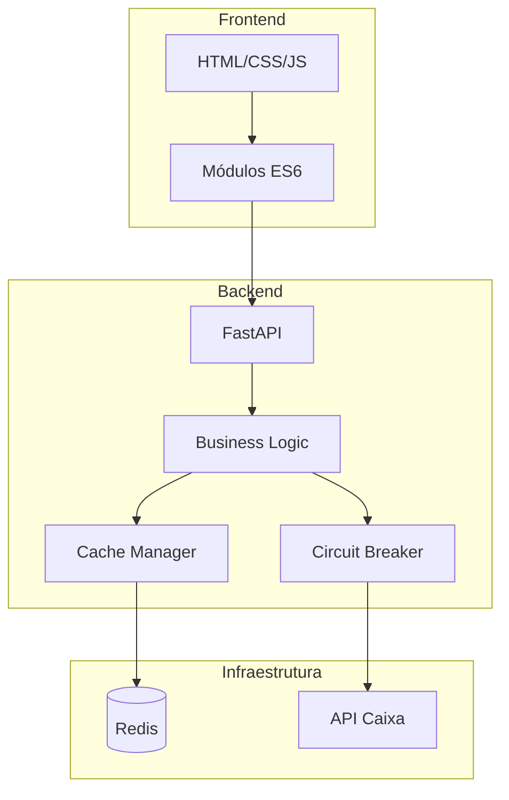

# Números da Sorte - Mega-Sena

[](https://www.python.org/)
[](https://fastapi.tiangolo.com/)
[](https://redis.io/)
[](https://www.docker.com/)
[](LICENSE)
[](backend/tests/)
[](backend/htmlcov/)

> Sistema de análise estatística da Mega-Sena com estimativas baseadas em dados históricos dos últimos 2 anos.

## Índice

- [Visão Geral](#-visão-geral)
- [Características](#-características)
- [Estrutura do Projeto](#-estrutura-do-projeto)
- [Arquitetura](#-arquitetura)
- [Tecnologias](#-tecnologias)
- [Instalação](#-instalação)
- [Uso](#-uso)
- [API](#-api)
- [Testes](#-testes)
- [Docker](#-docker)
- [CI/CD](#-cicd)
- [Licença](#-licença)

## Visão Geral

O **Números da Sorte** é uma aplicação full-stack profissional que analisa dados históricos da Mega-Sena para gerar estimativas estatísticas de números mais prováveis. O sistema utiliza análise de frequência dos últimos 2 anos de concursos para sugerir combinações de quadra, quina e sena.

### Funcionalidades Principais

- **Análise Estatística**: Processamento de dados históricos com cálculo de frequências
- **Estimativas Inteligentes**: Geração de quadra (4), quina (5) e sena (6) números
- **Busca por Data**: Consulta de resultados de concursos específicos
- **Cache Inteligente**: Sistema de cache com Redis e fallback em memória
- **Circuit Breaker**: Proteção contra falhas em cascata
- **Logging Estruturado**: Logs em JSON para análise e monitoramento
- **Segurança**: Rate limiting, CORS configurável, headers de segurança

### Demonstração


*A aplicação em funcionamento: gerando estimativas e buscando concursos por data.*


## Estrutura do Projeto

```
numeros-da-sorte/
├── backend/
│   ├── app/
│   │   ├── routes/          # Endpoints da API
│   │   ├── services/        # Lógica de negócio
│   │   ├── utils/           # Utilitários (cache, logging, etc)
│   │   ├── config.py        # Configurações
│   │   ├── exceptions.py    # Exceções customizadas
│   │   ├── models.py        # Modelos Pydantic
│   │   └── main.py          # Aplicação FastAPI
│   ├── tests/               # Testes automatizados
│   ├── Dockerfile           # Imagem Docker do backend
│   ├── requirements.txt     # Dependências de produção
│   └── requirements-dev.txt # Dependências de desenvolvimento
├── frontend/
│   ├── js/
│   │   ├── api.js           # Cliente API
│   │   ├── ui.js            # Manipulação DOM
│   │   ├── state.js         # Gerenciamento de estado
│   │   └── utils.js         # Funções utilitárias
│   ├── index.html           # Página principal
│   ├── styles.css           # Estilos
│   ├── script.js            # Aplicação principal
│   ├── nginx.conf           # Configuração Nginx
│   └── Dockerfile           # Imagem Docker do frontend
├── docs/
│   ├── architecture.md      # Documentação de arquitetura
│   └── api-examples.md      # Exemplos de uso da API
├── .github/
│   └── workflows/
│       └── ci.yml           # Pipeline CI/CD
├── docker-compose.yml       # Orquestração de containers
├── CONTRIBUTING.md          # Guia de contribuição
└── README.md                # Este arquivo
```

## Características

### Backend

- **Framework Moderno**: FastAPI com validação automática via Pydantic
- **Cache Distribuído**: Redis como cache primário com fallback para memória
- **Resiliência**: Circuit breaker para proteção de APIs externas
- **Observabilidade**: Logging estruturado com níveis configuráveis
- **Validação**: Modelos Pydantic para request/response
- **Documentação**: Swagger UI e ReDoc automáticos
- **Testes**: Cobertura de 70%+ com pytest
- **Type Safety**: Type hints e validação com mypy

### Frontend

- **Modular**: Código organizado em módulos ES6
- **Acessível**: ARIA attributes e suporte a leitores de tela
- **Responsivo**: Design adaptável para diferentes dispositivos
- **Estado Persistente**: LocalStorage para manter preferências
- **Retry Logic**: Tentativas automáticas com exponential backoff
- **Keyboard Shortcuts**: Atalhos para ações principais

## Arquitetura



Para mais detalhes, consulte a [Documentação de Arquitetura](docs/architecture.md).

## Tecnologias

### Backend
- **Python 3.11+**
- **FastAPI** - Framework web assíncrono
- **Pydantic** - Validação de dados
- **Redis** - Cache distribuído
- **Uvicorn** - Servidor ASGI
- **Requests** - Cliente HTTP
- **SlowAPI** - Rate limiting

### Frontend
- **HTML5** - Estrutura semântica
- **CSS3** - Estilização moderna
- **JavaScript ES6+** - Módulos e features modernas
- **Fetch API** - Comunicação com backend

### DevOps
- **Docker** - Containerização
- **Docker Compose** - Orquestração
- **GitHub Actions** - CI/CD
- **Pytest** - Framework de testes
- **Black** - Formatação de código
- **Flake8** - Linting
- **MyPy** - Type checking

## Instalação

### Pré-requisitos

- Python 3.11+
- Redis (opcional, usa fallback em memória)
- Docker e Docker Compose (para deploy containerizado)

### Instalação Local

#### Backend

```bash
cd backend

# Criar ambiente virtual
python -m venv venv

# Ativar ambiente virtual
# Windows:
venv\Scripts\activate
# Linux/Mac:
source venv/bin/activate

# Instalar dependências
pip install -r requirements.txt

# Copiar arquivo de configuração
copy .env.example .env

# Editar .env conforme necessário
```

#### Frontend

O frontend é estático e não requer instalação. Basta servir os arquivos com um servidor web.

## Uso

### Desenvolvimento

#### Backend

```bash
cd backend
uvicorn app.main:app --reload --host 0.0.0.0 --port 8000
```

A API estará disponível em `http://localhost:8000`

#### Frontend

Você pode usar qualquer servidor web estático. Exemplos:

```bash
# Python
cd frontend
python -m http.server 8080

# Node.js (http-server)
cd frontend
npx http-server -p 8080

# PHP
cd frontend
php -S localhost:8080
```

O frontend estará disponível em `http://localhost:8080`

### Produção com Docker

```bash
# Build e start todos os serviços
docker-compose up -d

# Ver logs
docker-compose logs -f

# Parar serviços
docker-compose down
```

Serviços disponíveis:
- Frontend: `http://localhost:8080`
- Backend API: `http://localhost:8000`
- API Docs: `http://localhost:8000/docs`
- Redis: `localhost:6379`

## API

### Endpoints Principais

#### Health Check
```http
GET /api/health
```

#### Gerar Estimativa
```http
GET /api/estimate
```

**Response:**
```json
{
  "data": "2024-01-15",
  "quadra": [5, 12, 23, 45],
  "quina": [5, 12, 23, 45, 58],
  "sorte": [5, 12, 23, 45, 58, 60]
}
```

#### Buscar Concurso por Data
```http
GET /api/draw/{date}
```

**Parâmetros:**
- `date`: Data no formato YYYY-MM-DD

**Response:**
```json
{
  "data": "15/01/2024",
  "numero_concurso": "2650",
  "numeros": [5, 12, 23, 45, 58, 60]
}
```

#### Estatísticas do Sistema
```http
GET /api/stats
```

#### Limpar Cache
```http
POST /api/cache/clear
```

### Documentação Interativa

- **Swagger UI**: `http://localhost:8000/docs`
- **ReDoc**: `http://localhost:8000/redoc`

Para exemplos completos, consulte [Exemplos de API](docs/api-examples.md).

## Testes

### Executar Todos os Testes

```bash
cd backend
pytest
```

### Testes com Cobertura

```bash
pytest --cov=app --cov-report=html --cov-report=term
```

Relatório HTML disponível em `backend/htmlcov/index.html`

### Testes por Categoria

```bash
# Apenas testes unitários
pytest -m unit

# Apenas testes de integração
pytest -m integration

# Testes lentos
pytest -m slow
```

### Linting e Type Checking

```bash
# Flake8
flake8 app/

# Black (formatação)
black --check app/

# MyPy (type checking)
mypy app/
```

## Docker

### Build das Imagens

```bash
# Backend
docker build -t megasena-backend ./backend

# Frontend
docker build -t megasena-frontend ./frontend
```

### Docker Compose

```bash
# Start
docker-compose up -d

# Logs
docker-compose logs -f backend

# Restart serviço específico
docker-compose restart backend

# Stop
docker-compose down

# Stop e remove volumes
docker-compose down -v
```

## CI/CD

O projeto utiliza GitHub Actions para CI/CD automático.

### Pipeline

1. **Lint**: Flake8, Black, MyPy
2. **Test**: Pytest com cobertura
3. **Build**: Docker images
4. **Security**: Trivy scan

### Executar Localmente

```bash
# Instalar dependências de desenvolvimento
pip install -r requirements-dev.txt

# Lint
flake8 app/
black --check app/
mypy app/

# Testes
pytest --cov=app

# Build Docker
docker-compose build
```

## Licença

Este projeto está sob a licença MIT. Veja o arquivo [LICENSE](LICENSE) para mais detalhes.


