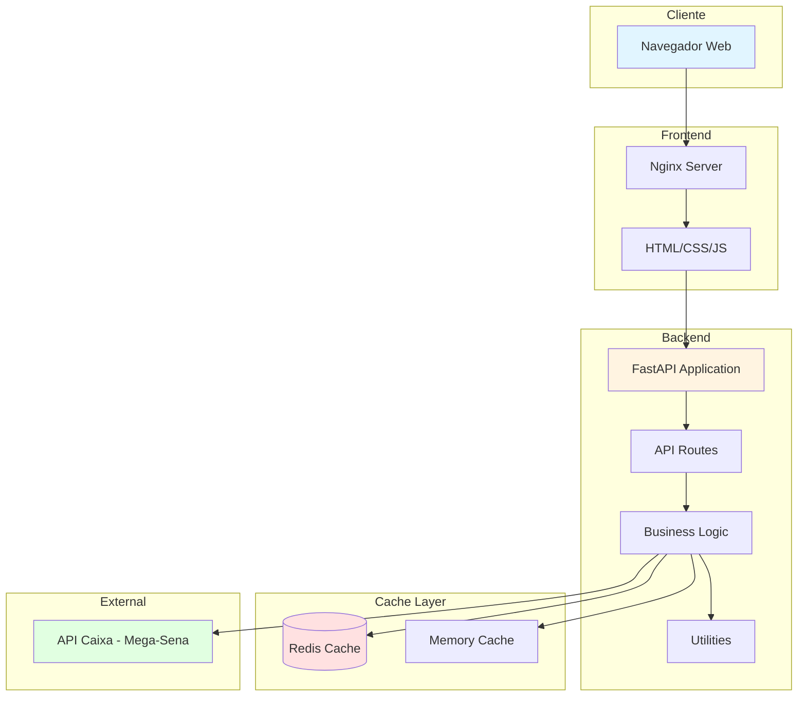
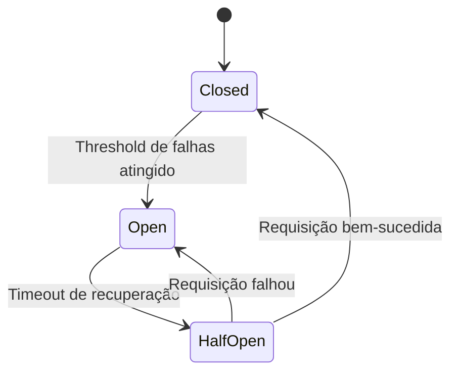
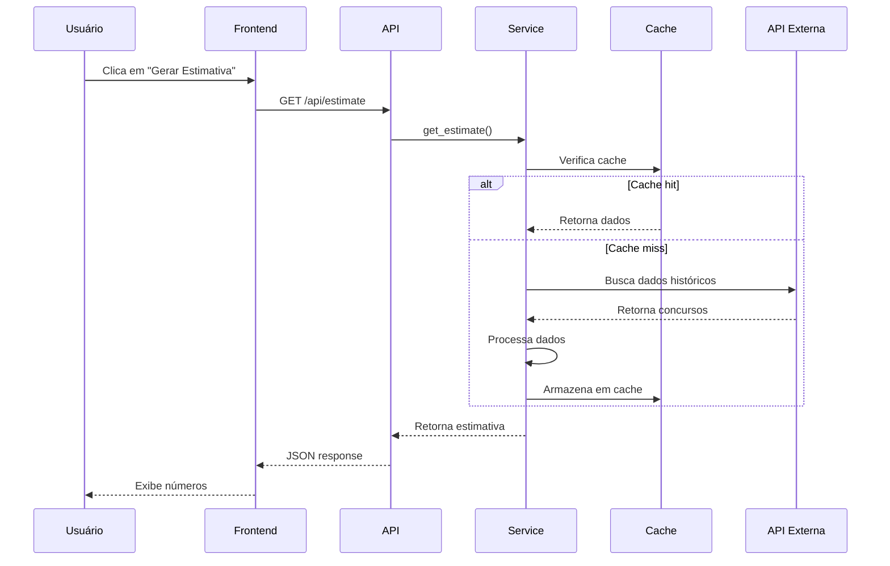
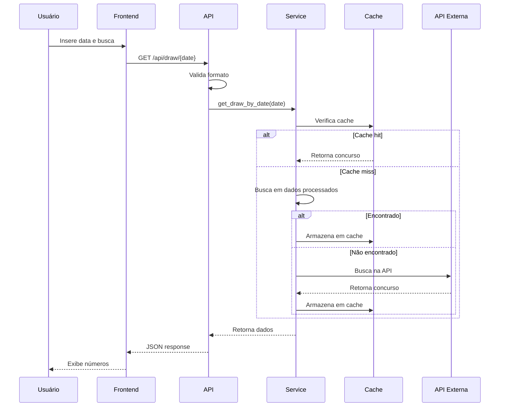

# Arquitetura do Sistema

## Visão Geral

O sistema Números da Sorte é uma aplicação web full-stack que analisa dados históricos da Mega-Sena para gerar estimativas estatísticas de números mais prováveis.

## Diagrama de Arquitetura

## Componentes Principais

### Frontend

**Tecnologias:**
- HTML5
- CSS3
- JavaScript (ES6+)
- Nginx (servidor web)

**Responsabilidades:**
- Interface do usuário
- Validação de entrada
- Comunicação com API
- Exibição de resultados

### Backend

**Tecnologias:**
- Python 3.11+
- FastAPI
- Uvicorn
- Pydantic

**Camadas:**

#### 1. API Layer (`app/routes/`)
- Define endpoints REST
- Validação de requisições
- Tratamento de erros
- Documentação automática (Swagger)

#### 2. Service Layer (`app/services/`)
- Lógica de negócio
- Integração com APIs externas
- Gerenciamento de cache
- Circuit breaker

#### 3. Utils Layer (`app/utils/`)
- Processamento de dados
- Logging estruturado
- Cache management
- Circuit breaker

### Cache

**Implementações:**
- **Redis**: Cache distribuído (produção)
- **Memory**: Cache em memória (desenvolvimento/fallback)

**Estratégia:**
- TTL configurável
- Invalidação automática
- Fallback transparente

### Proteções

#### Circuit Breaker

**Estados:**
- **Closed**: Operação normal
- **Open**: Bloqueando requisições
- **Half-Open**: Testando recuperação

## Fluxo de Dados

### Geração de Estimativa

### Busca por Data

## Segurança

### Headers de Segurança
- X-Content-Type-Options: nosniff
- X-Frame-Options: DENY
- X-XSS-Protection: 1; mode=block
- Strict-Transport-Security

### Rate Limiting
- Limite configurável por minuto
- Baseado em IP do cliente
- Resposta 429 quando excedido

### CORS
- Origens permitidas configuráveis
- Credenciais habilitadas
- Métodos e headers específicos

## Monitoramento

### Logging
- Formato JSON estruturado
- Níveis: DEBUG, INFO, WARNING, ERROR, CRITICAL
- Contexto adicional em cada log
- Rotação automática

### Métricas
- Tempo de resposta por endpoint
- Taxa de erro
- Status do circuit breaker
- Tipo de cache em uso

### Health Checks
- `/health`: Status básico
- `/api/health`: Status detalhado com métricas
- `/api/stats`: Estatísticas do sistema

## Escalabilidade

### Horizontal
- Stateless application
- Cache compartilhado (Redis)
- Load balancer ready

### Vertical
- ThreadPoolExecutor para paralelização
- Async/await para I/O
- Cache para reduzir carga

## Deploy

### Docker
- Multi-stage builds
- Imagens otimizadas
- Health checks integrados
- Volumes para persistência

### Orquestração
- Docker Compose para desenvolvimento
- Kubernetes ready (futuro)

## Melhorias Futuras

1. **Autenticação/Autorização**
   - JWT tokens
   - Rate limiting por usuário

2. **Observabilidade**
   - Prometheus metrics
   - Grafana dashboards
   - Distributed tracing

3. **Performance**
   - CDN para frontend
   - Database para histórico
   - GraphQL API

4. **Features**
   - Análise de padrões
   - ML predictions
   - Notificações
